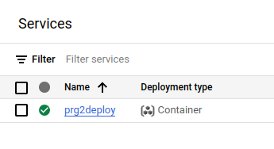

- Step 0)
Use the YAML file from .github/workflows/ as a deployment template for your project

- Step 1)
Check that your .NET version + directories names match the Dockerfile template in the workflow YAML file
```Dockerfile
FROM mcr.microsoft.com/dotnet/sdk:8.0 AS build
WORKDIR /src
COPY . .
RUN dotnet restore "server/api/api.csproj" #Example of path to the .csproj file til deploy
RUN dotnet publish "server/api/api.csproj" -c Release -o /app/publish

FROM mcr.microsoft.com/dotnet/aspnet:8.0
WORKDIR /app
COPY --from=build /app/publish .
ENV ASPNETCORE_URLS=http://0.0.0.0:8080
EXPOSE 8080
ENTRYPOINT ["dotnet", "api.dll"]

```

- Step 2) Add repository secrets:

(you only need NAME and GCP_SA_KEY - the rest are only if your API requires more environment variables like DB connectionstring)


How to find the values for the secrets:

2.1 Start off by finding the service account email is like this:
```bash
gcloud iam service-accounts list
```

Now use this for generating the SA key: (use this for the GCP_SA_KEY repository secret)
```bash
gcloud iam service-accounts keys create key.json --iam-account YOUR_SERVICE_ACCOUNT_EMAIL
```

The "NAME" variable in the YAML file is the name of your cloud run service - you can find the name using the GCloud CLI like this:
```bash
gcloud run services list
```
This is also the name you will see on the Cloud Run console services overview:



- Step 3)
Configure your startup such that your API listens on the port determined by the PORT environment variable (supplied by Google cloud)
Here's my entire startup:
```csharp
var port = Environment.GetEnvironmentVariable("PORT") ?? "8080";
var url = $"http://0.0.0.0:{port}";
var target = Environment.GetEnvironmentVariable("TARGET") ?? "World";

var app = builder.Build();

app.MapGet("/", () => $"Hello {target}!");

Console.WriteLine(JsonSerializer.Serialize(Environment.GetEnvironmentVariables()));
app.Run(url);
```

- Step 4)
Trigger it!

The workflow file feature's a "workflow dispatch" which you manually trigger like this:


You can also add other triggers like pull request, push, etc.